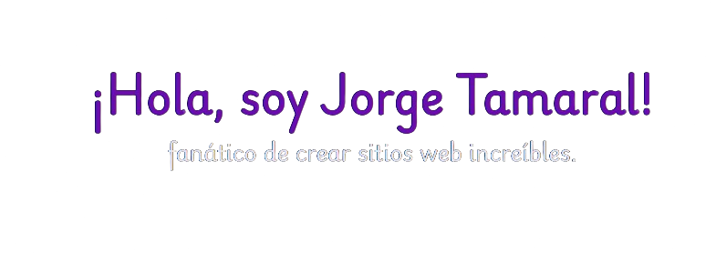

  

## Soy desarollador web Full Stack

**Sobre mí**

- 💼 Desarrollador Full Stack

- ❤️ Me encanta desarrollor webs funcionales y atractivas

- 💬 Pregúntame cualquier cosa [aquí](https://github.com/jorgetamaral/jorgetamaral/issues)

<code></code>
<code></code>
<code></code>
<code></code>
<code></code>
<code></code>
<code></code>    

|  |   |
| ------------- | ------------- |

